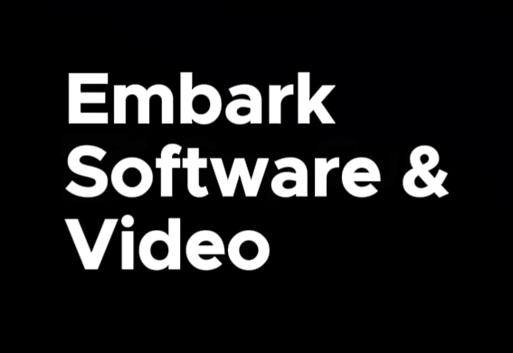

# Embark Software & Video 

 

## A Digital Agency That Does More

**Embark Software & Video** is a freelance digital solutions practice focused on helping businesses establish and enhance their online presence. I specialize in web development, video production, and digital strategy, working with clients who need quality work without enterprise-level budgets.
My approach combines creative problem-solving with practical technical skills to build websites, create content, and provide IT consulting that actually makes sense for small to mid-sized organizations. I leverage open-source technologies whenever possible to keep costs reasonable while delivering professional results.

I'm building this practice from the ground up, bringing experience in sales and recruiting to understand what clients really need and how to communicate effectively throughout projects. Whether you're looking for a new website, promotional video content, or help navigating digital transformation, I focus on delivering solutions that work for your business and your budget.
Currently growing my portfolio and client base—let's connect if you're looking for a collaborative partner who's invested in your success.

---

## Services

- **Strategic Web Design** - User-centered design that drives conversions
- **Custom Development** - Enterprise-grade applications built to scale
- **IT Consulting & Strategy** - Expert guidance on technology decisions
- **Digital Transformation** - End-to-end organizational modernization

## Contact

- 📫 How to reach me: [My Linkedin](https://www.linkedin.com/in/beckomw/)

---

*Client-Focused, Innovation-Driven.*

---

